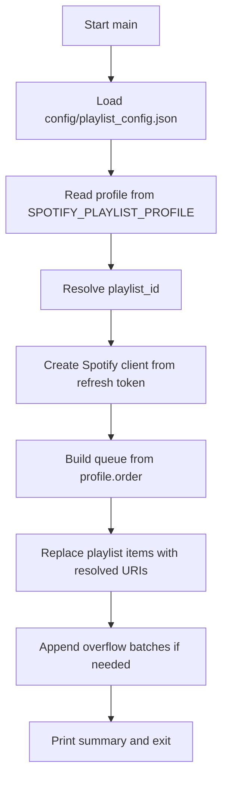
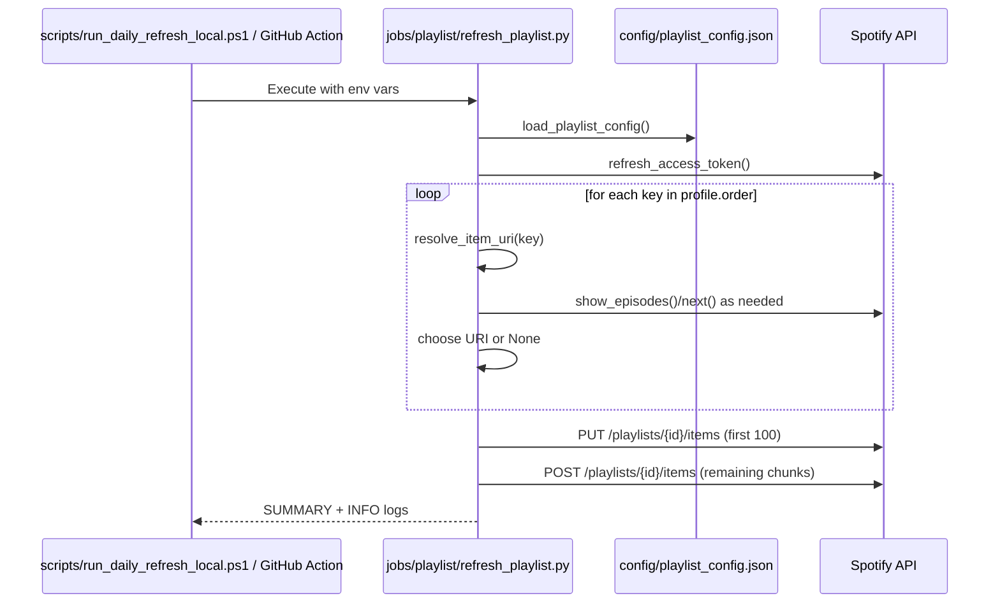
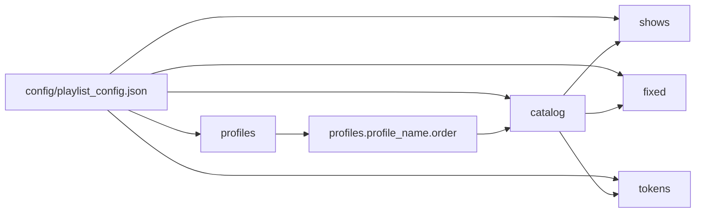
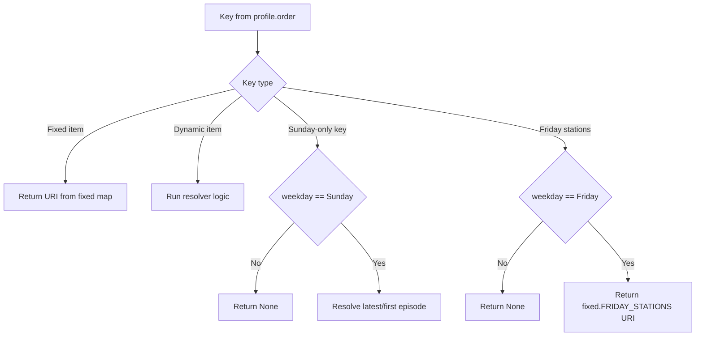
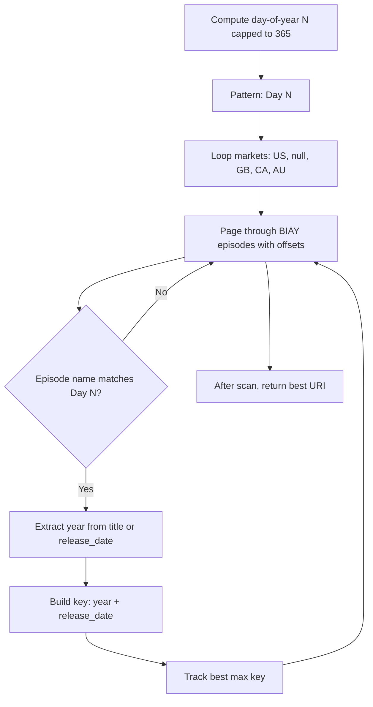

# refresh_playlist.py Architecture

This document explains how `jobs/playlist/refresh_playlist.py` builds each playlist run from `config/playlist_config.json`.

If Mermaid still does not render in your editor, open Markdown preview (not raw editor) and ensure Mermaid support is enabled in your IDE.

## High-Level Flow

## Runtime Sequence

## Config Dependency Model

## Resolver Dispatch (`resolve_item_uri`)

Each key in `profiles.<profile>.order` is dispatched by `resolve_item_uri(...)`.

Common dynamic resolvers:
- `latest_by_release_date(show_id)` for latest episode style feeds.
- `first_episode(show_id)` for newest item in show feed.
- `do_date_aware(show_id, terms)` for date-aware Divine Office picks.
- `sth_match_today(show_id, terms)` for STH date-prefix matches.
- `bible_in_a_year_for_today(show_id, status)` for Day N + newest year logic.

## BIAY Selection Logic

## Error Handling and Retries

- API calls go through `safe_call(...)`.
- `safe_call` retries on:
  - `429` (honors `Retry-After`)
  - `500/502/503/504` with backoff
- Unrecoverable failures return `None`, and resolvers gracefully skip unresolved keys.
- Script exits non-zero on critical failures (missing config/env/auth/no items resolved).

## Output Contract

On success:
- `SUMMARY playlist_id=<id> tracks_written=<n>`
- `INFO profile=<name> weekday=<day> playlist_recreated=true`
- Optional BIAY debug:
  - `INFO biay_day=<n> selected=<episode title>`

On failure:
- `ERROR ...` on stderr
- exit code `1`
